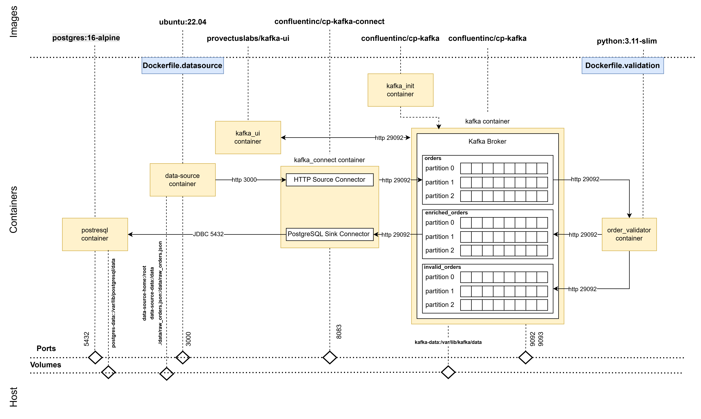
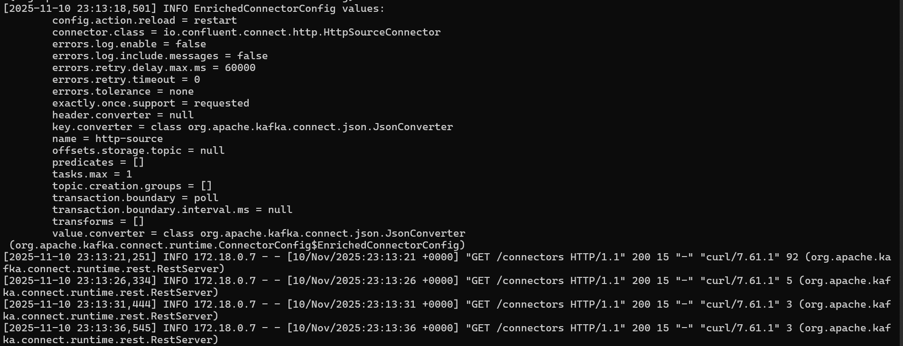
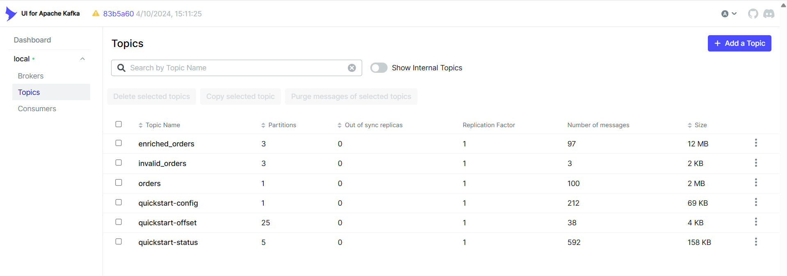
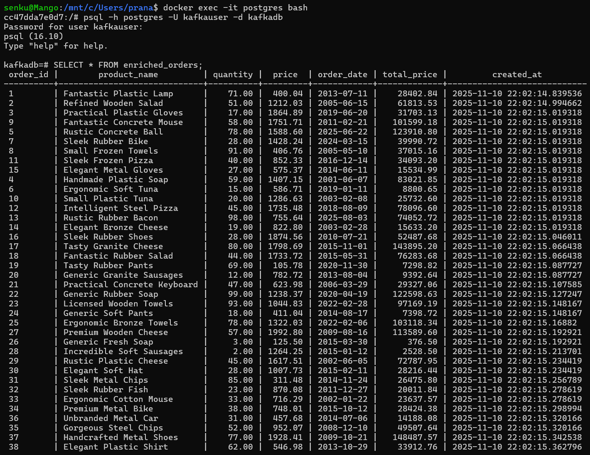

<h1>STREAM PROCESSING WITH KAFKA</h1>

*Stream processing with Kafka, using a local Kafka instance, Postgres, JSON server and Kafka Connect in containers.*

---

**Contents**:

<<<<<<< Updated upstream
1. [Setting Up](./docs/setting-up.md)
2. [Installation Verification](./docs/installation-verification.md)
=======
- [Architecture](#architecture)
- [Main project files](#main-project-files)
- [How to run the project](#how-to-run-the-project)

---

# Architecture


# Main project files
- [`docker-compose` file to set up the environment](./src/docker-compose.yaml)
- [Kafka Connect configurations (HTTP Source and PostgreSQL Sink)](./docs/kafka-connector-configurations.md)
- [Kafka Consumer code to process and enrich the data](./src/app/order_validator.py)

# How to run the project
1. Clone the repository
2. Navigate to `src/` within this cloned repository in your system
3. Then, run the following:

```
docker-compose -f docker-compose.yaml up -d
```

**NOTE**: `kafka-connect` will take some time before become ready; check Docker logs to confirm using:

```
docker logs kafka-connect -f
```

Once it is ready, you should begin to see GET requests:



5. For installation verification, see: [`docs/installation-verification.md`](./docs/installation-verification.md)
6. Once `kafka-connect` has been fully set up, configure the connectors
    - Configuration details: [`docs/kafka-connector-configurations.md`](./docs/kafka-connector-configurations.md)
    - Refer to Postman or Requestly collections through which to apply configurations:
        - [Postman](./postman/stream-processing/kafka-connect.json)
        - [Requestly](./requestly/stream-processing/kafka-connect.json)
    - Alternatively, execute cURL commands within `kafka-connect`:

**HTTP source connector configuration**:

```
curl --request POST \
  --url http://localhost:8083/connectors/ \
  --header 'Content-Type: application/json' \
  --data '
{
  "name": "http-source",
  "config": {
    "connector.class": "io.confluent.connect.http.HttpSourceConnector",
    "topic.name.pattern": "orders",
    "url": "http://host.docker.internal:3000/orders",
    "http.offset.mode": "SIMPLE_INCREMENTING",
    "http.initial.offset": "1",
    "request.interval.ms": "86400000",
    "key.converter": "org.apache.kafka.connect.json.JsonConverter",
    "value.converter": "org.apache.kafka.connect.json.JsonConverter",
    "key.converter.schemas.enable": "false",
    "value.converter.schemas.enable": "false",
    "confluent.topic.bootstrap.servers": "kafka:29092",
    "confluent.topic.replication.factor": "1",
    "confluent.topic.security.protocol": "PLAINTEXT"
  }
}'
```

**PostgresSQL sink connector configuration**:

```
curl --request POST \
  --url http://localhost:8083/connectors/ \
  --header 'Content-Type: application/json' \
  --data '
{
  "name": "postgres-sink",
  "config": {
    "connector.class": "io.confluent.connect.jdbc.JdbcSinkConnector",
    "tasks.max": "1",
    "topics": "enriched_orders",
    "connection.url": "jdbc:postgresql://host.docker.internal:5432/kafkadb",
    "connection.user": "kafkauser",
    "connection.password": "kafkapass",
    "value.converter": "org.apache.kafka.connect.json.JsonConverter",
    "value.converter.schemas.enable": "true",
    "key.converter": "org.apache.kafka.connect.storage.StringConverter",
    "auto.create": "true",
    "insert.mode": "insert",
    "delete.enabled": "true",
    "table.name.format": "enriched_orders",
    "pk.mode": "record_key",
    "pk.fields": "order_id"
  }
}'
```

7. Verify the connector statuses using the following endpoints:
    - GET `http://localhost:8083/connectors/http-source/status` (for HTTP source connector)
    - GET `http://localhost:8083/connectors/postgres-sink/status` (for PostgreSQL sink connector)
    - Here, again, you can use cURL or Requestly/Postman collection
8. Add orders to JSON server's data source:
    - POST `http://localhost:3000/orders`:
        - Request body: {
              "order_id": 155,
              "product_name": "Autonomous Mobile Robot - WASP",
              "quantity": 2,
              "price": 200,
              "order_date": "2025-11-09",
              "id": "64b7"
      }
        - headers = {"Content-Type": "application/json"}
    - Here, again, you can use cURL or Requestly/Postman collection
9. Verify that the messages are published to the appropriate topics in Kafka UI

**NOTE**: `order-validator` consumers the `orders` streams, and publishes messages onto one of:

- `invalid_orders`
- `enriched_orders`

In the Kafka UI, you should be able to see something like this:



10. The enriched orders are written to PostgreSQL, which you can verify using:

```sh
# Access the postgres container terminal using:
docker exec -it postgres bash

# Execute the PostgreSQL CLI using:
psql -h postgres -U kafkauser -d kafkadb
# Upon being prompted for a password, type: kafkapass

# In the command terminal, execute:
SELECT * FROM enriched_orders;
```

You should be seeing something like this:


>>>>>>> Stashed changes
